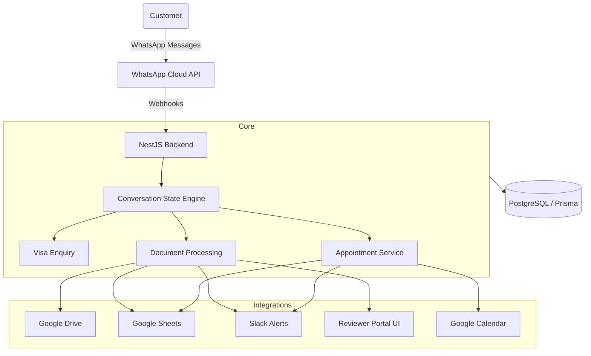

# Travel Visa WhatsApp Chatbot


A production-ready WhatsApp chatbot designed to automate and streamline the travel visa application process. Built with NestJS, PostgreSQL, Prisma, and the official Meta WhatsApp Cloud API.

> **Disclaimer:** This is a demonstration travel-visa workflow platform and is not an official government immigration service.

---

## 1. Overview

The Travel Visa WhatsApp Chatbot acts as an automated virtual assistant, guiding applicants through Visa requirements, secure document collection, and appointment scheduling, while providing staff with a professional dashboard for case management and review.

## 2. Key Features

- **Visa Enquiries**: Guided conversational flows for identifying correct visa types.
- **Document Collection**: Secure upload, hashing (SHA-256 idempotency), and versioning of applicant documents.
- **Human Document Review**: Secure web portal for staff to approve or reject documents with reason-tracking.
- **Appointment Scheduling**: Checks availability and books introductory consultation calls seamlessly.
- **Integrations**: Automatically synchronizes with Google Drive (storage), Google Sheets (logging), and Slack (alerting).

## 3. System Architecture



## 4. User Journey

1. **Start**: User sends "Hi" on WhatsApp.
2. **Options**: System presents interactive buttons (Visa Enquiry, Document Upload, Appointment Booking, Check Status).
3. **Draft**: User drafts an enquiry or books a slot.
4. **Upload**: User uploads required media (e.g. Passport photo).
5. **Review**: Staff receives Slack alert, reviews file in Web Portal, and clicks Approve/Reject.
6. **Notification**: User receives WhatsApp alert with staff decision.

## 5. Visa Enquiry Flow
Interactive menu prompting users for nationality, destination, and visa type (Tourist/Business), terminating in a customized requirements checklist.

## 6. Document Workflow
1. User uploads an image via WhatsApp.
2. System downloads bytes securely from Meta CDN.
3. Hashes file with SHA-256 for idempotency (blocks duplicates).
4. Persists to Google Drive and creates a `RECEIVED` database record.
5. Notifies staff via Slack.

## 7. Reviewer Workflow
Staff access a secure HTML Dashboard displaying `Pending`, `Approved`, and `Rejected` documents.
- Approvals trigger an instant WhatsApp success message.
- Rejections enforce a mandatory reason, triggering a WhatsApp message asking the applicant to upload a replacement.
- Uploading a replacement increments the document to `v2` and intelligently blocks stale `v1` actions.

## 8. Appointment Workflow
Users can request an introductory call. The system dynamically queries Google Calendar for `freeBusy` slots in the `Asia/Kolkata` timezone over the next 7 days, gracefully degrading if no slots exist, and confirming real events directly onto the calendar upon selection.

## 9. Integrations
- **Meta Cloud API**: Webhook verification and conversational UI.
- **Google Drive**: Persists applicant media uploads.
- **Google Sheets**: Maintains an append-only tracking log of cases.
- **Google Calendar**: Real-time read/write availability checking.
- **Slack**: Webhook alerts to a private staff channel for review triage.

## 10. Technology Stack
- **Backend**: NestJS, TypeScript, Node.js v18+
- **Database**: PostgreSQL
- **ORM**: Prisma
- **Testing**: Vitest
- **Linting/Formatting**: Prettier, Oxlint

## 11. Project Structure
- `/src/whatsapp` - Meta webhook handlers and API service.
- `/src/conversation` - In-memory state machine for conversation flows.
- `/src/documents` - Media hashing, processing, and the Reviewer Portal Controller.
- `/src/calendar` - Google Calendar API services.
- `/src/appointments` - Appointment slot logic.
- `/src/drive` & `/src/sheets` & `/src/slack` - External integrations.

## 12. Local Setup
```bash
git clone https://github.com/Dhruv17204/travel-visa-whatsapp-chatbot.git
cd travel-visa-whatsapp-chatbot
npm install
npx prisma generate
npx prisma db push
```

## 13. Environment Variables
Create a `.env` file. **Never commit this.**
```
DATABASE_URL=
PORT=3000
META_VERIFY_TOKEN=
META_ACCESS_TOKEN=
META_APP_SECRET=
GOOGLE_DRIVE_FOLDER_ID=
GOOGLE_SHEETS_ID=
GOOGLE_CALENDAR_ID=
SLACK_WEBHOOK_URL=
REVIEWER_TOKEN=
REVIEWER_BASE_URL=
GOOGLE_SERVICE_ACCOUNT_EMAIL=
GOOGLE_PRIVATE_KEY=
```

## 14. Running the Application
```bash
# Development
npm run start:dev

# Production
npm run build
npm run start:prod
```
*Use `ngrok http 3000` to expose webhooks during local development.*

## 15. Testing
Comprehensive integration test suite covering API stubs, DB interactions, and HTML rendering.
```bash
npm test
```

## 16. Security Design
- **Webhook Integrity**: `X-Hub-Signature-256` validation against Meta App Secret.
- **Token Protection**: Dashboard uses strict `?token=` parameter matching against `.env`.
- **Idempotency**: Prevents file bloat via SHA-256 checking.
- **Stale Protection**: Concurrent edits to old versions are blocked safely.

## 17. Screenshots
Screenshots of the system in action:
*(Place your screenshots in the `docs/screenshots/` directory)*
- `docs/screenshots/whatsapp-main-menu.png`
- `docs/screenshots/visa-enquiry-flow.png`
- `docs/screenshots/document-upload.png`
- `docs/screenshots/document-review-dashboard.png`
- `docs/screenshots/appointment-booking.png`
- `docs/screenshots/slack-notification.png`

## 18. Demo
*A complete video walkthrough of the integration is available on Google Drive:*
[Insert Google Drive Demo Link Here]

## 19. Known MVP Limitations
- Queueing: API requests execute synchronously. Implementing BullMQ is recommended for scaling.
- Webhook Memory Cache: Idempotency webhooks rely on local process cache.

## 20. Disclaimer
This is a demonstration travel-visa workflow platform and is not an official government immigration service.
